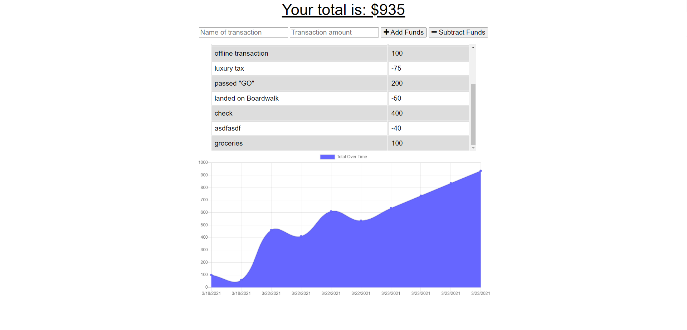

# Budget Tracker

[Description](#description)

[Licence](#license)

[Installation](#installation)

[Usage](#usage)

[Dependencies](#dependencies)

[Contributing](#contributing)

[GitHub Link](#github-link)

## Description
A budget tracker that tracks both on and offline (offline in progress)

### License
GNU General Public Licence

### Installation
N/A

### Usage
Type in any income or expenses, and add with the UI buttons

### Dependencies
Dependencies include express, mongoose, and a webpack dev dependency.

### Contributing
email ryanpburnett@yahoo.com

### GitHub Link
https://github.com/ryanpburnett

The repo for this readme generator can be found on RPB's [Github](https://github.com/ryanpburnett/readme-generator) page.